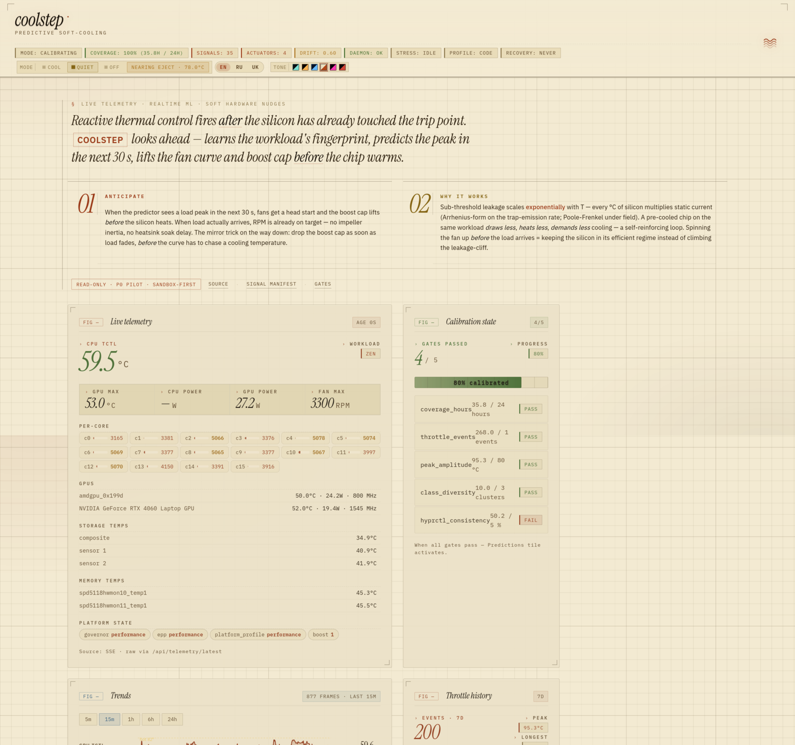
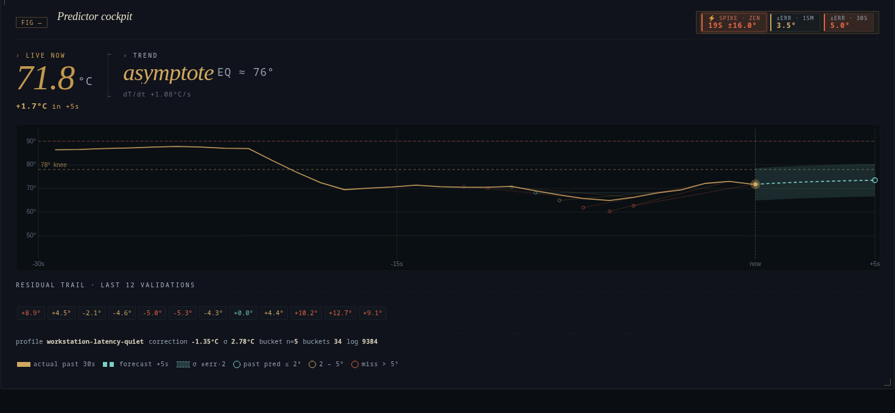
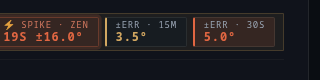
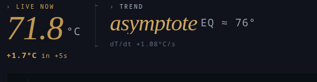
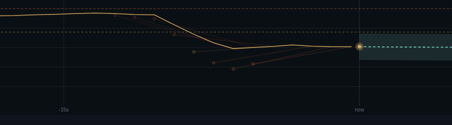

<div align="center">

# coolstep

**Predictive soft-cooling for Linux.**
*Local realtime ML that smooths thermal spikes before the reactive controller wakes up.*

[](LICENSE)
[](https://www.python.org/)
[](https://github.com/zzallirog/coolstep/releases/tag/v0.5.11)
[](#tested-against)
[](docs/interference-matrix.md)

<picture>
  <source srcset="docs/img/dashboard-hero.webp" type="image/webp">
  
</picture>

<sub><i>Read-only dashboard at <code>http://127.0.0.1:18889/</code> — newspaper-style instrument log over live thermal telemetry.</i></sub>

</div>

---

## 01 · Anticipation

When the predictor sees a load spike in the next thirty seconds, the
fans get a head start. The boost limit lifts before silicon heats. By
the time the workload actually lands, RPM is already at target — no
impeller inertia, no radiator warm-up lag. The mirror trick on the way
down: drop the boost limit as soon as load falls, before the fan curve
starts chasing a temperature that's already dropping.

The reactive controller is not broken. It is structurally late, because
fans have inertia and silicon doesn't. coolstep operates in the few
seconds the reactive loop can't reach.

→ [`docs/concept.md`](docs/concept.md) · [`docs/physics-rationale.md`](docs/physics-rationale.md)

## 02 · One brain, two targets

The same KNN runs on a laptop and on a rack. The signals differ — fan
RPM and EPP versus inlet temperature and BMC power — but the inference
is the same. coolstep auto-detects which side of the line you're on and
arranges itself: quiet and responsive on the desktop, foresight on the
server. One CLI flag overrides the detection when needed.

A laptop user asks "why is the fan loud right now?" A rack admin asks
"when will this chassis degrade?" Same daemon, different question,
different presentation.

→ [`docs/p3-plan.md`](docs/p3-plan.md)

## 03 · Compose, don't replace

`asusctl`, `ryzenadj`, `nbfc-linux`, `coolercontrol`,
`nct6687-driver-dkms-git` — these already work, already shipped, already
loved by their communities. coolstep is the conductor, not the violin.
When a driver is missing on your distro, you get a pointer to install
it, not a warning to ignore. The orchestrator never writes to hwmon
directly; it wraps the tools that know what they're doing.

→ [`docs/stack-decisions.md`](docs/stack-decisions.md) (ADR-010)

## 04 · Monitoring first

You can run coolstep as a read-only analytical dashboard and never opt
in to hardware writes. Many users do exactly that. The "armed" mode —
actually nudging the fan curve — is gated behind eight calibration
checks and stays disabled by default until you decide otherwise. The
dashboard is the product; the actuator is the privilege.

→ [`docs/calibration-gates.md`](docs/calibration-gates.md)

## 05 · Read the cockpit

The predictor cockpit tile makes one promise: every number is paired
with the parameter that gives it meaning, so the operator never reads
a naked figure they have to translate in their head.

<p align="center">
  
</p>

<table>
<tr>
<td width="33%"></td>
<td width="33%"></td>
<td width="33%"></td>
</tr>
<tr>
<td><sub><b>Header:</b> ⚡ spike-active badge with workload label · twin <code>±err</code> chip (15 m slow / 30 s fast)</sub></td>
<td><sub><b>Hero:</b> live °C paired with Δ over +5 s · trend phrase paired with raw <code>dT/dt</code></sub></td>
<td><sub><b>Bucket strip:</b> meta correction + σ + sample-count <code>n</code> · shrinkage prior visibly widens σ on young buckets</sub></td>
</tr>
</table>

| where | what it shows | paired with |
|---|---|---|
| **LIVE NOW** | latest sample, °C | Δ — predicted change over the +5 s horizon |
| **TREND** | phrase: `→78° in 6s` · `cooling −10°/21s` · `asymptote eq ≈ 76°` · `past knee` · `steady` | raw dT/dt printed underneath for the operator who wants the °C/s anyway |
| **Canvas** | past 30 s actual (gold trail) overlaid with forecast +5 s (dashed cool) | σ-corridor shaded around the forecast, 78 °C knee + 90 °C danger as dashed reference lines |
| **Past predictions** | hollow rings where we said the chip would land | thin segment to where it actually did, coloured by \|residual\| (≤ 2° / 2–5° / > 5°) |
| **⚡ Spike chip** | visible when the predictor was surprised: \|residual\| ≥ 5 °C for 2 consecutive ticks | duration · max \|residual\| · workload label; closure writes an `Incident(kind="predictor_spike")` so future zen / Steam / speedtest fingerprints get recognised |
| **±err 15 M / 30 S** | twin pill — slow rolling quality vs what this workload is doing right now | same colour ladder, so the split reads as "long-haul fine, transient spike" at a glance |

<p align="center">
  
  <br>
  <sub><i>Canvas detail — gold actual trail descends from a past plateau; hollow rings mark where we previously said it would land, with thin segments to where it actually did (red = miss > 5°). Forecast at <code>now</code> sits inside the σ-corridor; the knee reference line is the dashed band cutting horizontally across.</i></sub>
</p>

The math underneath is intentionally pedestrian. Newton-cooling
saturation through `T₀ + s·τ·(1 − e^(−h/τ))` for the +5 s forecast,
a Bayesian shrinkage prior on the per-bucket residual correction so
two agreeing samples don't report σ = 0.01 °C confidence, one OLS
slope over the last five frames for the live dT/dt readout. Stdlib
only, no scipy. The forecast curve anchors on the meta-corrected
endpoint so the dashed line and the predicted ring agree — operator
never sees "line shoots to 91°, ring sits at 85°".

→ [`docs/stack-decisions.md`](docs/stack-decisions.md) (ADR-020, ADR-021) ·
screenshots in [v0.5.4](https://github.com/zzallirog/coolstep/releases/tag/v0.5.4)
+ [v0.5.5](https://github.com/zzallirog/coolstep/releases/tag/v0.5.5) release notes

## 06 · Local and private

Nothing leaves the host. No model upload, no telemetry, no cloud sync.
Thermal data correlates with what you're doing — your apps, your
schedule, your day. coolstep treats that as personal data and keeps it
on disk where it belongs.

→ [`docs/stack-decisions.md`](docs/stack-decisions.md) (ADR-008)

## 07 · Tested against

<a name="tested-against"></a>

Coolstep shares the thermal/power surface with other actors —
`power-profiles-daemon`, `TLP`, `asusctl`, `thermald`, `game-mode.service`,
Feral `gamemoded`, BMC firmware, and (worst of all) another coolstep
instance. v0.5.1 introduces a two-layer test pillar that makes those
coordination points visible:

**Hardware matrix** — 12 synthetic snapshots replay representative
`/sys + /proc + /etc` trees through `detect_caps()` end-to-end:

| Class | Snapshot |
|---|---|
| ASUS gaming laptop | TUF A15 FA507XV (Ryzen 9 7940HS + 4060M) |
| AMD desktop + dGPU | Ryzen 9 7950X + RTX 4090, Fedora + KDE |
| Intel ultrabook | ThinkPad X1 Carbon Gen 11, Ubuntu + GNOME |
| AMD laptop, non-ASUS | Framework 13 (Ryzen 7 7840U), Debian + Hyprland |
| Handheld | Steam Deck OLED (SteamOS, gamescope) |
| Intel desktop (Mac hw) | Mac Mini i5-4278U, Fedora + applesmc |
| ARM SBC | Raspberry Pi 5 (BCM2712) |
| Rack server (Intel) | Dell PowerEdge R750 + iDRAC9 Redfish |
| Rack server (Intel) | HP ProLiant DL380 Gen10 + iLO5 |
| Rack server (AMD) | Supermicro H12 dual EPYC 7763 |
| Cloud ARM (KVM) | Oracle Cloud Free Tier Ampere A1 |
| Container | Alpine LXC (degenerate `/sys`) |

**Interference matrix** — 17 scenarios assert what happens when coolstep
collides with another actor that owns part of the same surface. **9 covered
gates · 4 open gaps · 4 structural separations.** The matrix is honest:
known unfixed conflicts carry explicit fix proposals and stay visible until
closed.

→ [`docs/interference-matrix.md`](docs/interference-matrix.md) ·
[`docs/hw-matrix.md`](docs/hw-matrix.md)

---

## Install

Two install paths. Both put a `coolstep` binary on your `PATH` that
runs from anywhere, plus three daemon entry points (`coolstep-collector`,
`coolstep-dashboard`, `coolstep-mcp`) that you opt into separately.

> **⚠ Never `sudo pip install`.** coolstep is a user-level tool. The
> daemon runs as your regular user; data and config live under
> `~/.local/` and `~/.config/`. Installing as root puts files where
> the user daemon can't reach them and breaks env-var inheritance from
> your shell. If you ever need privileged access for hardware writes
> (fan curves, RAPL, ryzenadj), it is granted **per-capability via
> systemd unit overrides** — never by running the whole tool as root.
> See [docs/privileges.md](docs/privileges.md).

> **Heads-up:** install only puts the binaries on `PATH`. It does **not**
> start the daemon. After install, `coolstep compat` works immediately
> as a read-only diagnostic; the daemon is a deliberate second step.
> See [What runs, what doesn't](#what-runs-what-doesnt).

### Path A — pipx (recommended, any distro)

```bash
pipx install git+https://github.com/zzallirog/coolstep
```

**Why this path.** `pipx` puts coolstep in its own isolated venv at
`~/.local/share/pipx/venvs/coolstep` and symlinks the binaries into
`~/.local/bin/`. Distro-agnostic, no PEP 668 conflicts, no clashes
with system Python packages. Easy to upgrade
(`pipx upgrade coolstep`) and remove (`pipx uninstall coolstep`).

**Expected output.** A progress bar, then:

```
  installed package coolstep 0.5.11, installed using Python 3.12+
  These apps are now available:
    - coolstep
    - coolstep-collector
    - coolstep-dashboard
    - coolstep-mcp
done! ✨ 🌟 ✨
```

**If `pipx` is missing.** `pacman -S python-pipx` (Arch) /
`apt install pipx` (Debian, Ubuntu) / `dnf install pipx` (Fedora).

**If `pipx` warns about existing files** in `~/.local/bin/` — you have
a `pip --user` install (path B below) holding the same shim names.
Either run `pip uninstall --break-system-packages coolstep` first and
retry, or stay on path B; the two are mutually exclusive.

### Path B — pip --user (any distro, minimal footprint)

```bash
pip install --user --break-system-packages git+https://github.com/zzallirog/coolstep
```

**Why this path.** Smallest possible install — no extra tool, no extra
venv, just packages added to your `~/.local/lib/python*/site-packages/`
tree. Use this if you already manage system Python deliberately and
know what you're opting into.

**Why the awkward flag.** Modern Arch, Debian and Fedora ship system
Python with PEP 668 enabled, which refuses bare `pip install` by
default to protect distro-managed packages from being shadowed.
`--break-system-packages` opts out for this one command only; `--user`
keeps the install in `~/.local/` and never touches system packages.

**Expected output.** Standard pip output, ending in:

```
Successfully installed coolstep-0.5.11
```

---

### What runs, what doesn't

Right after install — regardless of path — three things are true:

1. **`coolstep compat` works immediately.** Run it from any directory.
   It prints the platform report (which collectors activated, what's
   available, what's missing, how to fix gaps). Read-only, never
   touches hardware. This is the fastest sanity check that the install
   succeeded.

2. **The daemon is not running.** Neither `coolstep-collector` nor
   `coolstep-dashboard` is started. The dashboard at
   `http://127.0.0.1:18889/` does not respond yet.

3. **No systemd units are enabled.** They're installed and visible to
   `systemctl --user list-unit-files | grep coolstep`, but neither is
   active. You decide when to enable them.

To bring the daemon up, run these four commands in order:

```bash
coolstep install-units                                                # 1. write systemd user units
systemctl --user daemon-reload                                        # 2. let systemd see them
systemctl --user enable --now coolstep-collector coolstep-dashboard   # 3. enable + start
coolstep doctor                                                        # 4. verify
xdg-open http://127.0.0.1:18889/
```

That sequence is the same for both Path A (pipx) and Path B (pip --user)
and does not require a checkout of this repository — every step uses
the `coolstep` binary that was placed on your `PATH`.

`coolstep install-units` drops the unit files into
`~/.config/systemd/user/`.  pipx and pip don't install systemd units
automatically, so this step is needed for non-AUR installs.  If you
installed via a future AUR package, the units are already in
`/usr/lib/systemd/user/` and you can skip this command.

**Optional — first-run wizard.** If you have a local git checkout of
this repository, you can replace step 1 with the bundled wizard:

```bash
git clone https://github.com/zzallirog/coolstep && cd coolstep
coolstep install-units             # the wizard restarts units, so install them first
bash scripts/coolstep_init.sh      # detects laptop/desktop/server, drops the
                                    # matching .conf, seeds ~/coolstep/data/,
                                    # bootstraps calibration, verifies units
```

The wizard is a convenience for people working from a clone; without
the clone, the four-command sequence above does the same job minus the
auto-detected profile drop-in.

`enable --now` does two things at once: marks the units to start at
login and starts them immediately. Without `--now`, they'd only fire
on next login. Without `enable`, they'd run this session and forget on
reboot.

To verify daemon health:

```bash
systemctl --user status coolstep-collector coolstep-dashboard
coolstep doctor              # full health check
```

To stop and disable:

```bash
systemctl --user disable --now coolstep-collector coolstep-dashboard
```

Hardware actuators stay in dry-run by default. Even with the daemon
enabled, no fan curves move and no sysfs nodes are written until you
explicitly set `COOLSTEP_ACTUATOR_ENABLE=true` in the systemd unit
override — and even then, only after the eight calibration gates
([`docs/calibration-gates.md`](docs/calibration-gates.md)) clear.

### Requirements

- Linux kernel ≥ 5.10
- Python 3.10–3.13 recommended. **Python 3.14** had a `chromadb`
  rust-bindings segfault — resolved in v0.5.9 by routing the hot
  KNN read-path through `hnswlib` (`COOLSTEP_KNN_BACKEND=hnsw`,
  ADR-022). `chromadb<1.0` is pinned as fallback; the daemon stays
  on `MetaPredictor(TrajectoryBaseline + ResidualBank)` if the KNN
  store is unavailable. See
  [troubleshooting](docs/troubleshooting.md#chromadb-segfaults-on-python-314).
- **KNN backend (optional `[ml]` extras).** The install command differs
  by path because `pipx`-installed projects can't be re-resolved with a
  bare `pip install pkg[extra]` — pip won't see the existing pipx venv:

  ```bash
  # Path A (pipx) — inject extras into the same isolated venv:
  pipx inject coolstep "chromadb<1.0" "chroma-hnswlib>=0.7.6"

  # Path B (pip --user) — extras work the standard way:
  pip install --user --break-system-packages "coolstep[ml]"
  ```

  Either form pulls `chromadb<1.0` + `chroma-hnswlib>=0.7.6` into the
  right place. Without ML extras the daemon still runs — it just falls
  back to `MetaPredictor(TrajectoryBaseline + ResidualBank)` and skips
  the KNN read-path.

  Do **not** install bare upstream `hnswlib` alongside — both packages
  ship the same `hnswlib` module file, and the upstream `.so` will
  silently overwrite the chroma fork's, leaving KNN queries returning
  empty.
- One of `pipx`, `pip`, or `uv` (most distros have at least one
  pre-installed; minimal hosts like Proxmox base or Alpine may need a
  one-time install — see
  [troubleshooting](docs/troubleshooting.md#minimal-host-without-pip-or-pipx-proxmox-ve-base-container-images))
- systemd (only for the daemon mode — `coolstep compat` works without
  it on any init system)
- No root required for the dashboard, `coolstep compat`, or any
  read-only collector. Some optional collectors and all hardware-write
  actuators do want extra capabilities — see
  [docs/privileges.md](docs/privileges.md) for the full table and the
  per-capability systemd drop-in templates.

---

## Roadmap

| Phase | Status |
|---|---|
| P0 — foundation, four collectors, dashboard | ✅ |
| P1 — calibration window, throttle FSM, audit closure | ✅ |
| P2 — actuator stack with sandbox-first defaults | ✅ |
| P2.5 — perf and ML/control hardening | ✅ |
| P2.6 — predictor cockpit relational metrics + 30 s err chip | ✅ v0.5.4 |
| P2.7 — spike-driven training archive (detector + incident plumbing) | ✅ v0.5.4 |
| P2.8 — HNSW backend selector + embedder refit + trust modes | ✅ v0.5.9 |
| P2.9 — atomic ml-state / runtime-state, sqlite lock, cockpit `asyncio.to_thread` | ✅ v0.5.10 |
| P2.10 — docs sync (HNSW everywhere; trust modes; AUR PKGBUILD) | ✅ v0.5.11 |
| **P3 — two deployment targets, three-layer manifest, community pointers** | **✅ v0.5.0** |
| P3.1 — dashboard target-aware tile reordering | ⚪ |
| P3.2 — `coolstep manifest update` (community feed sync) | ⚪ |
| P3.3 — `coolstep doctor --facet=server` | ⚪ |
| P3.4 — Prometheus export endpoint | ⚪ |
| P4 — Windows / macOS adapters | ⚪ future |

---

## Where to read further

| File | Topic |
|---|---|
| [`docs/concept.md`](docs/concept.md) | Why this exists at all |
| [`docs/physics-rationale.md`](docs/physics-rationale.md) | Arrhenius and Poole–Frenkel, why peaks beat averages |
| [`docs/architecture.md`](docs/architecture.md) | Module map, the tick loop, the three independent layers |
| [`docs/telemetry-schema.md`](docs/telemetry-schema.md) | Every field, every collector, how the frame composes |
| [`docs/calibration-gates.md`](docs/calibration-gates.md) | The eight gates between dry-run and armed mode |
| [`docs/efficiency-curve.md`](docs/efficiency-curve.md) | `work_per_degree`, the sweet spot, and the knee |
| [`docs/curve-ownership.md`](docs/curve-ownership.md) | Who manages the fan curve at each layer — BIOS, vendor tool, your profile, coolstep bias — and where coolstep's authority ends |
| [`docs/drift-detection.md`](docs/drift-detection.md) | Seven indicators that the model has gone stale |
| [`docs/stack-decisions.md`](docs/stack-decisions.md) | Twenty ADRs covering why this stack and not another (ADR-001…024) |
| [`docs/p3-plan.md`](docs/p3-plan.md) | The two-target design and the three-layer manifest |
| [`docs/troubleshooting.md`](docs/troubleshooting.md) | Every warning `coolstep compat` can print, with per-distro fixes |
| [`docs/privileges.md`](docs/privileges.md) | What needs root, why, and how to grant the minimum safely |
| [`CONTRIBUTING.md`](CONTRIBUTING.md) | What we accept readily and what needs discussion |
| [`CHANGELOG.md`](CHANGELOG.md) | Feature history by version |

---

## Help & support

- **Something broke or behaves wrong?**
  Run `coolstep compat --install-plan` first — it prints the per-distro
  fix for most missing-dependency cases. If that's not enough, the
  [troubleshooting guide](docs/troubleshooting.md) covers every warning
  `coolstep compat` can emit, with per-distro commands.
- **Question, idea, show-and-tell?**
  [GitHub Discussions](https://github.com/zzallirog/coolstep/discussions)
  is the canonical place. Lower friction than issues, easier to find
  later.
- **Bug you can reproduce?**
  [Open an issue](https://github.com/zzallirog/coolstep/issues/new/choose).
  The bug-report template asks for `coolstep compat --json` —
  including that one piece is the difference between a triaged issue
  and one that sits open for a week.
- **Hardware not detected?**
  Use the [hardware-support issue template](https://github.com/zzallirog/coolstep/issues/new?template=hardware-support.yml).
  Single-chip additions usually land within 48 h. Most additions are
  one entry in [`coolstep/compat/core.json`](coolstep/compat/core.json).

---

## License

MIT — see [LICENSE](LICENSE).
